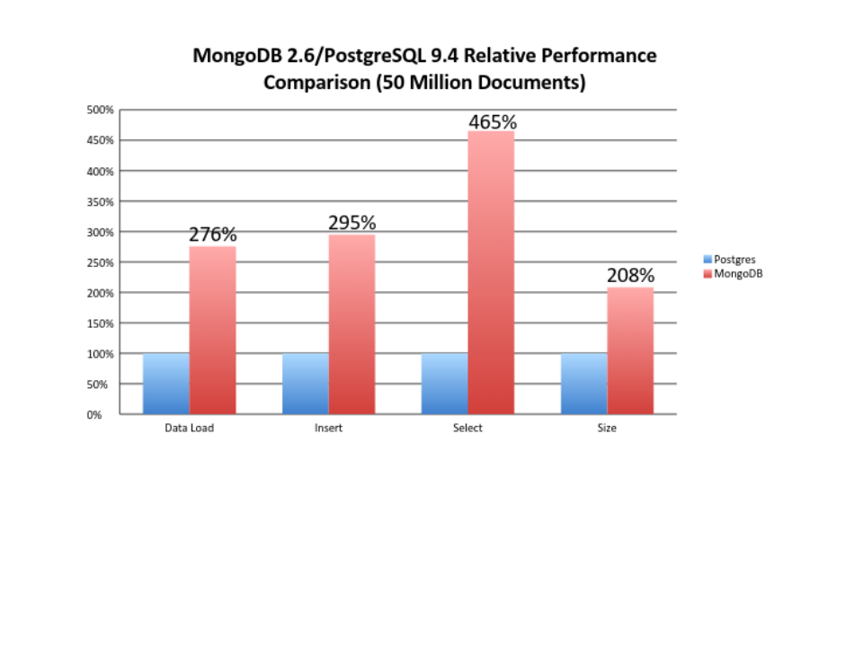

This blog post will be updated along with the progress made in the backend student website project. The website can always be viewed [here](http://139.59.93.32/), though in the initial phase it will be a prototype. Once the changes are approved by the mentors, the project will be updated on the original domain. This will be carried out either every week or two weeks, whichever is convenient.  

## Implementation  

### Framework to be used  

The current backend for BioJS is in node.js.  After a discussion with one of the mentors, Rowland Mosbergen, I came  to the knowledge that the main sysadmin is more familiar with a python framework. Using a python framework will facilitate more efficient maintenance of the website in the future. Also the sysadmin has ansible for serving a Pyramid/Postgres/Apache server. Hence, time would be saved for the same.

Python frameworks are extremely structured and have better development principles as well as they possess a lot of built-in features. Also they have inherent support for a lot of database systems, including PostgreSQL, which I plan to use for data storage and management. PostgreSQL sorting and querying is a lot faster as compared to MongoDB. Integration with database systems such as MySQL and PostgreSQL is easier when using a python framework.  

### Database System

Currently, the development plan for the backend requires MongoDB to be used as the database management system. As discussed with Rowland Mosbergen, I proposed to use PostgreSQL for the project. This is due to:
1. Storing the data in a relational table would be more efficient than in JSON format since data retrieval can be made by querying on the columns. The required key, value pairs can easily be parsed for a JSON response.
2. The database is perfectly structured. The biggest advantage, or disadvantage of MongoDB is that it has a flexible schema. Keeping scalability in mind, the database is uniform for all the components. The schema would be updated in the future to incorporate new pieces of data.
3. **Postgres has a strongly typed schema that leaves very little room for errors.**
4. Database size required would be very less compared to MongoDB since Postgres stores information more efficiently and data isn't unnecessarily duplicated across tables.
5. Below is a comparison of performance between MongoDB(latest stable release : 3.6.3) and PostgreSQL(latest stable release : 10.3)

6. Also, the sysadmin is more familiar with PostgreSQL. So in a wider scenario, it will prove to be a better option.  

### Implementation of data transfer using AJAX/Comet

All the requests will be made using AJAX or Comet, with the response in JSON format. It will be easier to be organized in the above mentioned format in a fast and efficient manner.

### Serving static files directly using nginx/apache

Whichever reverse proxy is used, the static files(JS, CSS, Images etc.) will be served as normal files from nginx/apache. The path would be specified according to the links created in the front end part. This would mean that the request would need not be forwarded to the application, but would be served directly by the reverse proxy.  

### Server side caching of Data(If time permits!)

A database such as **redis** or **memcache** will be used to cache requests server side. As data would be stored in RAM, it will be served immediately and the functioning of the website will be extremely quick. Another implementation can also be carried out using **pyramid-beaker** if the pyramid framework is used.